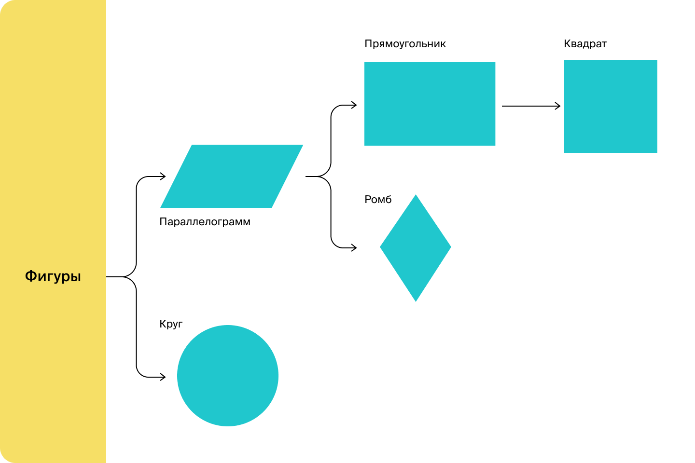

# Задача

В этом задании вам необходимо применить полученные знания об интерфейсах и абстрактных классах так, чтобы связать все
фигуры в единую иерархию и написать программу-калькулятор, вычисляющую площадь фигур: ромба, квадрата, прямоугольника и
круга. Перед тем как вы начнёте, изучите одно небольшое, но важное примечание.

#### Примечание

В случае наследования интерфейсов следует быть осторожными. Соблюдайте логическую непротиворечивость и базовые принципы
подстановки. Например, в этом тренажёре вам необходимо связать прямоугольник и квадрат в цепочку наследования. Если
рассматривать вопрос с математической точки зрения, то сомнений не будет. Но с точки зрения логики методов, которые
будут исполняться в классах, может возникнуть парадокс.

Представьте, что у интерфейса `Прямоугольник` есть методы, устанавливающие ширину и высоту
фигуры — `getWidth()/setWidth(
int w)` и `getHeight()/setHeight(int h)`. А у интерфейса `Квадрат` может появиться метод `getSize()/setSize(int s)` —
сторона
квадрата.

В классе, который реализует интерфейс `Квадрат` вы будете вынуждены реализовать все три метода. Таким образом, меняя
сторону квадрата, вы будете неявно менять два значения: ширину и высоту фигуры. И такое поведение может быть неожиданным
для того кода, который использует ваш объект, считая его `Прямоугольником`.

Чтобы избежать этого парадокса, нужно добавить в интерфейсы только общие методы.

```java
public class Practice {
    public static void main(String[] args) {
        Rectangle rectangle = new Rectangle(4, 6);
        System.out.println("Площадь прямоугольника 4см*6см = " + rectangle.getArea());

        Square square = new Square(3);
        System.out.println("Площадь квадрата 3см*3см = " + square.getArea());

        Rhombus rhombus = new Rhombus(4, 3);
        System.out.println("Площадь ромба со стороной 4см и высотой 3см = " + rhombus.getArea());

        Circle circle = new Circle(2);
        System.out.println("Площадь круга с радиусом 2см = " + circle.getArea());
    }
}
```

```java
// В качестве корня иерархии всех фигур необходимо использовать заготовку интерфейса Figure
public interface Figure {
    // Ниже напишите объявление метода/ов, которые будут общими для всей иерархии классов
    ...
}
```

```java
public class Circle {
    // Радиус круга
    private final double r;

    public Circle(double r) {
        this.r = r;
    }

    public double getArea() {
        return Math.PI * r * r;
    }
}
```

```java
public ...Parallelogram ...{
        }
```

```java
public class Rectangle {
    // Длины сторон прямоугольника
    private final double a;
    private final double b;

    public Rectangle(double a, double b) {
        this.a = a;
        this.b = b;
    }

    public double getArea() {
        return a * b;
    }
}
```

```java
public class Rhombus {
    // Длина стороны ромба
    private final double a;
    // Высота ромба
    private final double h;

    public Rhombus(double a, double h) {
        this.a = a;
        this.h = h;
    }

    public double getArea() {
        return a * h;
    }
}
```

```java
public class Square {
    // Длина стороны квадрата
    private final double a;

    public Square(double a) {
        this.a = a;
    }

    public double getArea() {
        return a * a;
    }
}
```

*Подсказки ниже*

<br><br><br><br><br><br><br><br><br><br><br><br>

###### Подсказки

- У классов `Square`, `Rhombus` и `Rectangle` совпадает реализация метода `double getArea()`. Такой метод можно вынести в
абстрактный класс `Parallelogram`.
- У всех классов есть метод `double getArea()`. Поскольку сигнатура метода одинаковая, а способ подсчёта площади фигуры
внутри метода — разный, метод можно вынести в базовый интерфейс `Figure`.
- Классы `Square`, `Rhombus` и `Rectangle` используют одинаковый набор параметров, эти параметры можно вынести в абстрактный
класс и создать конструктор с параметрами.
- Некоторые из фигур являются частными случаями других. Например, квадрат — это частный случай прямоугольника, а
прямоугольник — частный случай параллелограмма.
- Такие фигуры можно унаследовать друг от друга. Если затрудняетесь построить иерархию фигур, воспользуйтесь схемой:
<br>

